# System Design Architecture Presentation — Imagify

**Project:** Imagify — AI-Powered Text-to-Image Generation Platform
**Repository:** [ManiishPal/imagify](https://github.com/ManiishPal/imagify)
**Date:** 2026-03-14
**Author:** Manish Pal

---

## Table of Contents

1. [Executive Summary](#1-executive-summary)
2. [System Overview](#2-system-overview)
3. [Architectural Style & Patterns](#3-architectural-style--patterns)
4. [High-Level System Architecture](#4-high-level-system-architecture)
5. [UML Diagrams](#5-uml-diagrams)
   - 5.1 [Component Diagram](#51-component-diagram)
   - 5.2 [Class Diagram](#52-class-diagram)
   - 5.3 [Sequence Diagrams](#53-sequence-diagrams)
   - 5.4 [Deployment Diagram](#54-deployment-diagram)
   - 5.5 [Use Case Diagram](#55-use-case-diagram)
   - 5.6 [State Machine Diagram](#56-state-machine-diagram)
   - 5.7 [Activity Diagram](#57-activity-diagram)
   - 5.8 [Package Diagram](#58-package-diagram)
6. [Data Flow Architecture](#6-data-flow-architecture)
7. [Security Architecture](#7-security-architecture)
8. [Technology Stack Summary](#8-technology-stack-summary)
9. [Conclusion](#9-conclusion)

---

## 1. Executive Summary

Imagify is a full-stack **SaaS-style AI image generation** web application built on the **MERN stack** (MongoDB, Express.js, React, Node.js). It follows a **client-server monorepo** architecture where:

- The **frontend** (React + Vite) provides an interactive single-page application (SPA) for users to register, log in, generate AI images from text prompts, and purchase credits.
- The **backend** (Express.js + Node.js) exposes a RESTful API that handles authentication, credit management, AI image generation via ClipDrop API, and payment processing via Razorpay.
- **MongoDB Atlas** serves as the cloud-hosted NoSQL database for persisting user data and transaction records.

The platform operates on a **credit-based model** — new users receive 5 free credits and can purchase additional credits through integrated payment plans.

---

## 2. System Overview

```
 ┌──────────────┐        HTTPS/REST         ┌──────────────────┐
 │              │  ◄─────────────────────►   │                  │
 │   React SPA  │        Axios + JWT         │  Express.js API  │
 │   (Client)   │                            │    (Server)      │
 │              │                            │                  │
 └──────────────┘                            └────────┬─────────┘
                                                      │
                                          ┌───────────┼───────────┐
                                          │           │           │
                                          ▼           ▼           ▼
                                    ┌──────────┐ ┌─────────┐ ┌──────────┐
                                    │ MongoDB  │ │ClipDrop │ │ Razorpay │
                                    │  Atlas   │ │   API   │ │ Gateway  │
                                    └──────────┘ └─────────┘ └──────────┘
```

**Key Characteristics:**
- **Separation of Concerns:** Frontend and backend are independently deployable
- **Stateless API:** JWT-based authentication; no server-side sessions
- **Credit-based Access Control:** Users must have credits to generate images
- **Third-party Integration:** External APIs for AI (ClipDrop) and payments (Razorpay)

---

## 3. Architectural Style & Patterns

| Pattern | Application |
|---------|-------------|
| **Client-Server** | React SPA communicates with Express.js REST API |
| **MVC (Model-View-Controller)** | Server uses Models (Mongoose), Controllers (business logic), and Routes (request routing) |
| **Context Pattern (Frontend)** | React Context API (`AppContext`) provides global state management |
| **Middleware Pipeline** | Express middleware chain for CORS, JSON parsing, and JWT authentication |
| **Repository Pattern** | Mongoose models abstract database operations |
| **Monorepo** | Both `client/` and `server/` reside in a single repository |
| **RESTful API** | Resource-oriented HTTP endpoints (`/api/user`, `/api/image`) |
| **Token-based Auth** | Stateless JWT authentication for protected routes |

---

## 4. High-Level System Architecture

```
┌─────────────────────────────────────────────────────────────────────────────┐
│                              PRESENTATION TIER                              │
│                                                                             │
│  ┌─────────────────────────────────────────────────────────────────────┐    │
│  │                    React SPA (Vite + Tailwind CSS)                  │    │
│  │                                                                     │    │
│  │  ┌───────────┐  ┌───────────┐  ┌────────────┐  ┌───────────────┐  │    │
│  │  │  Pages    │  │Components │  │  Context   │  │   Assets      │  │    │
│  │  │ Home      │  │ Navbar    │  │ AppContext │  │ Images/Icons  │  │    │
│  │  │ Result    │  │ Footer    │  │ (State)    │  │               │  │    │
│  │  │ BuyCredit │  │ Login     │  │            │  │               │  │    │
│  │  │           │  │ Header    │  │            │  │               │  │    │
│  │  │           │  │ Steps     │  │            │  │               │  │    │
│  │  │           │  │ Descript. │  │            │  │               │  │    │
│  │  │           │  │ Testimon. │  │            │  │               │  │    │
│  │  │           │  │ GenBtn    │  │            │  │               │  │    │
│  │  └───────────┘  └───────────┘  └────────────┘  └───────────────┘  │    │
│  └─────────────────────────────────────────────────────────────────────┘    │
│                                     │ Axios HTTP (JSON + JWT)               │
└─────────────────────────────────────┼───────────────────────────────────────┘
                                      │
                                      ▼
┌─────────────────────────────────────────────────────────────────────────────┐
│                             APPLICATION TIER                                │
│                                                                             │
│  ┌─────────────────────────────────────────────────────────────────────┐    │
│  │                   Express.js REST API (Node.js)                     │    │
│  │                                                                     │    │
│  │  ┌───────────┐  ┌───────────────┐  ┌───────────┐  ┌────────────┐  │    │
│  │  │  Routes   │  │  Controllers  │  │Middleware │  │   Config   │  │    │
│  │  │ userRoute │  │ userCtrl      │  │ auth.js   │  │ mongodb.js │  │    │
│  │  │ imageRoute│  │ imageCtrl     │  │ (JWT)     │  │            │  │    │
│  │  └───────────┘  └───────────────┘  └───────────┘  └────────────┘  │    │
│  │  ┌───────────────────────┐                                         │    │
│  │  │       Models          │                                         │    │
│  │  │  userModel            │                                         │    │
│  │  │  transcationModel     │                                         │    │
│  │  └───────────────────────┘                                         │    │
│  └─────────────────────────────────────────────────────────────────────┘    │
└─────────────────────────────────────┼───────────────────────────────────────┘
                                      │
                    ┌─────────────────┼─────────────────┐
                    │                 │                  │
                    ▼                 ▼                  ▼
┌─────────────────────────────────────────────────────────────────────────────┐
│                                DATA TIER                                    │
│                                                                             │
│     ┌──────────────┐     ┌──────────────────┐     ┌──────────────────┐     │
│     │  MongoDB     │     │  ClipDrop AI     │     │  Razorpay        │     │
│     │  Atlas       │     │  API             │     │  Payment Gateway │     │
│     │  (Database)  │     │  (External)      │     │  (External)      │     │
│     └──────────────┘     └──────────────────┘     └──────────────────┘     │
└─────────────────────────────────────────────────────────────────────────────┘
```

---

## 5. UML Diagrams

### 5.1 Component Diagram

This diagram shows the major structural components and their dependencies.

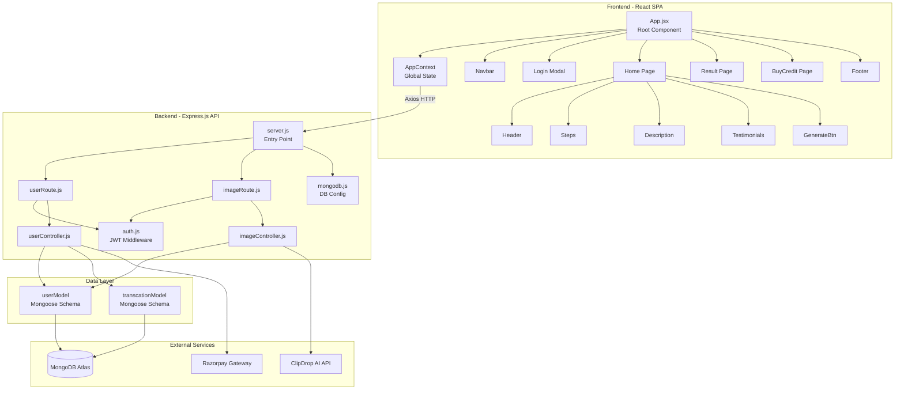

---

### 5.2 Class Diagram

This diagram models the data entities and controller classes in the system.

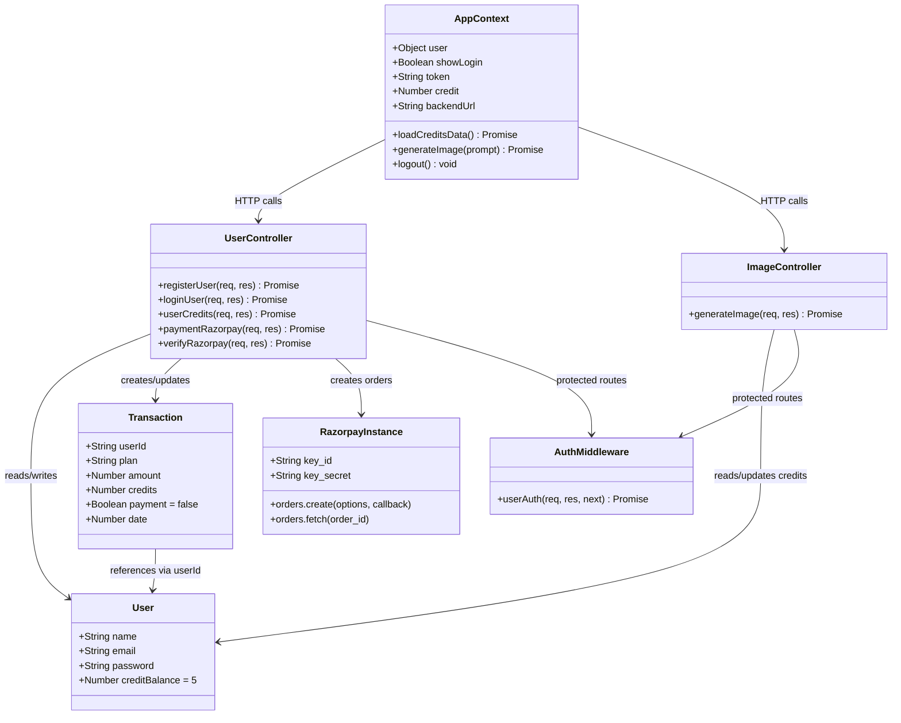

---

### 5.3 Sequence Diagrams

#### 5.3.1 User Registration Flow

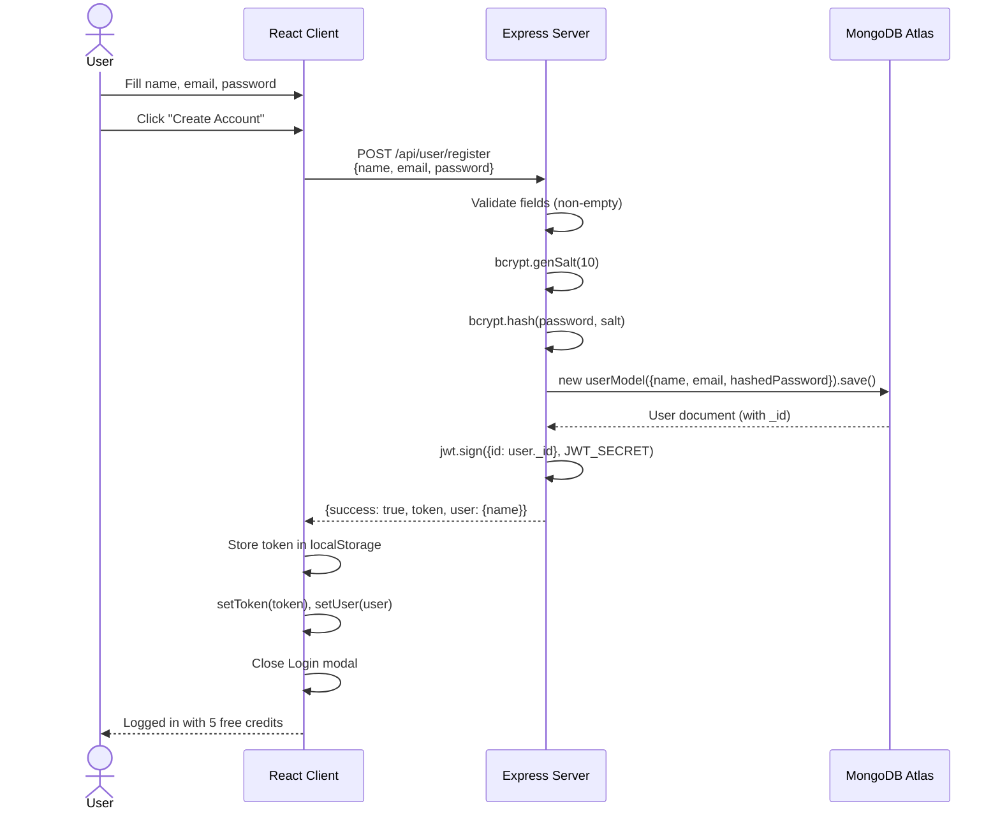

#### 5.3.2 User Login Flow

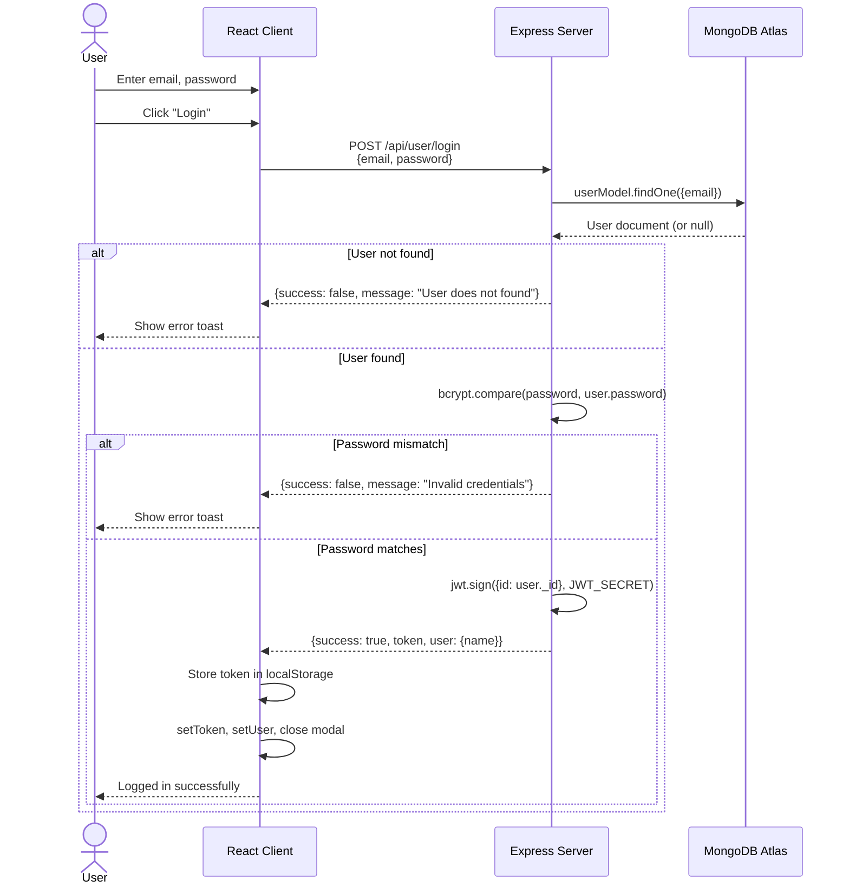

#### 5.3.3 AI Image Generation Flow

```mermaid
sequenceDiagram
    actor U as User
    participant C as React Client
    participant CTX as AppContext
    participant S as Express Server
    participant MW as Auth Middleware
    participant DB as MongoDB Atlas
    participant AI as ClipDrop API

    U->>C: Enter text prompt
    U->>C: Click "Generate"
    C->>CTX: generateImage(prompt)
    CTX->>S: POST /api/image/generate-image<br/>Headers: {token}<br/>Body: {prompt}
    S->>MW: userAuth(req, res, next)
    MW->>MW: jwt.verify(token, JWT_SECRET)
    MW->>MW: Inject userId into req.body
    MW-->>S: next()
    S->>DB: userModel.findById(userId)
    DB-->>S: User document
    S->>S: Check creditBalance > 0
    alt No credits
        S-->>CTX: {success: false, message: "No credit Balance"}
        CTX->>C: toast.error() + navigate('/buy')
        C-->>U: Redirect to Buy Credits page
    else Has credits
        S->>S: Create FormData with prompt
        S->>AI: POST /text-to-image/v1<br/>Headers: {x-api-key}<br/>Body: FormData
        AI-->>S: Binary image data (arraybuffer)
        S->>S: Buffer.from(data).toString('base64')
        S->>DB: findByIdAndUpdate(creditBalance - 1)
        DB-->>S: Updated user
        S-->>CTX: {success: true, resultImage: "data:image/png;base64,...",<br/>creditBalance: N-1}
        CTX->>CTX: loadCreditsData()
        CTX-->>C: Return resultImage
        C->>C: Display generated image
        C-->>U: Show image with download option
    end
```

#### 5.3.4 Credit Purchase Flow (Razorpay)

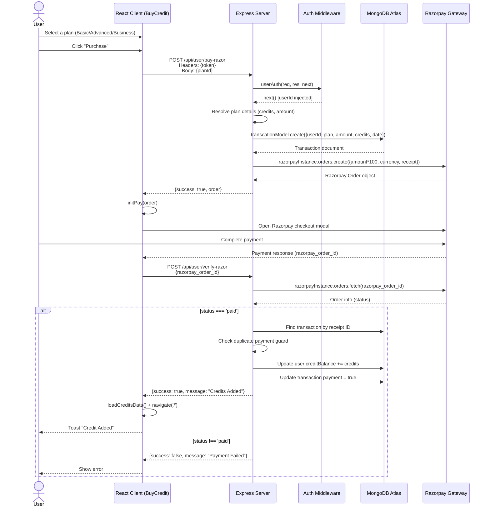

#### 5.3.5 JWT Authentication Middleware Flow

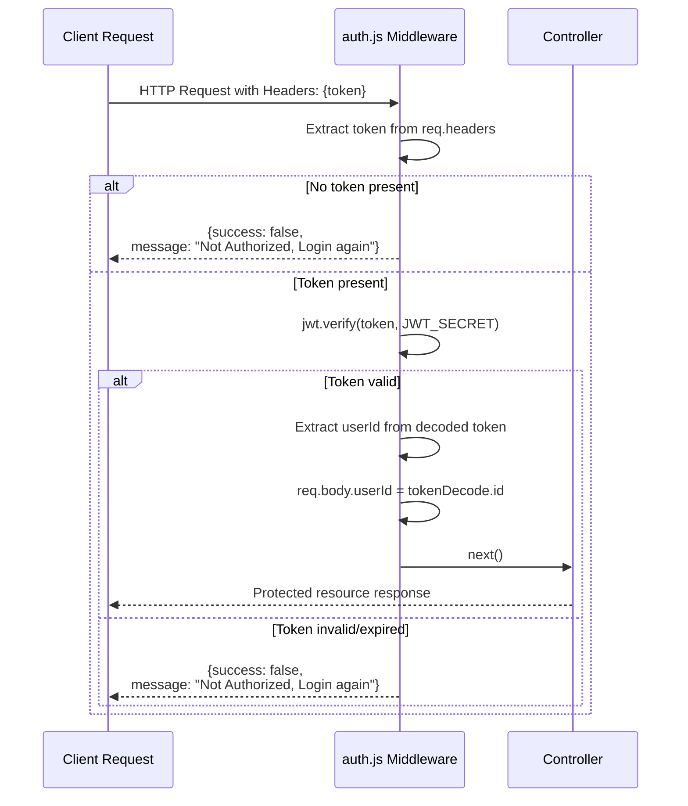

---

### 5.4 Deployment Diagram

This diagram shows the physical deployment architecture of the system.

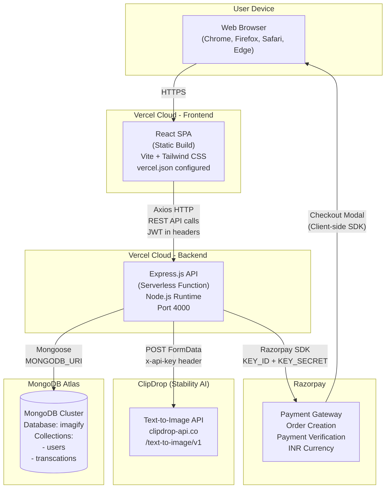

---

### 5.5 Use Case Diagram

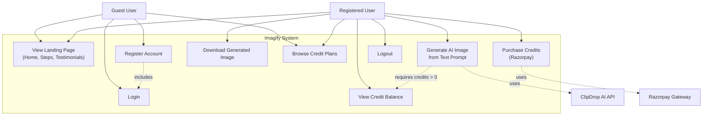

---

### 5.6 State Machine Diagram

#### 5.6.1 User Authentication State

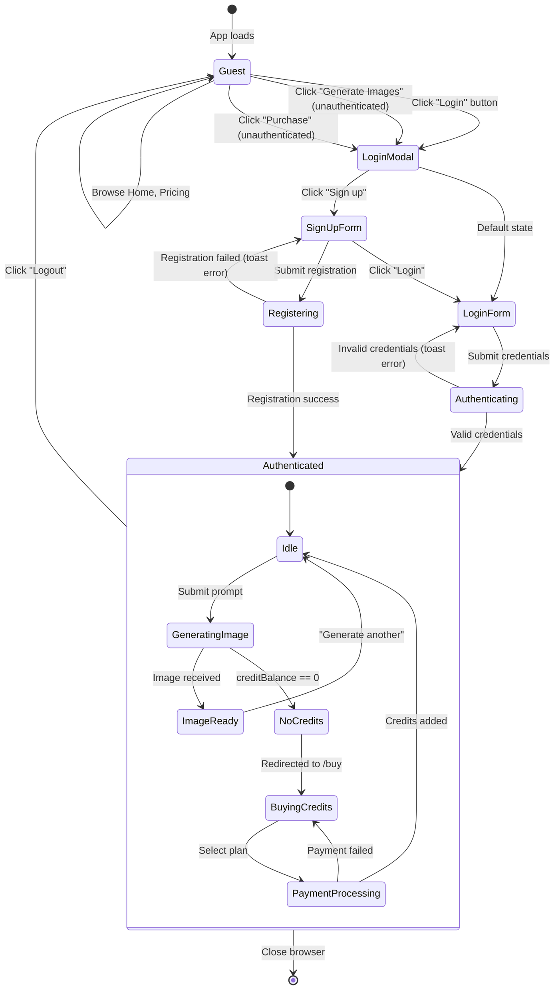

#### 5.6.2 Transaction Payment State

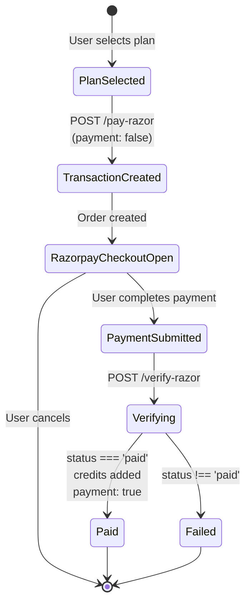

---

### 5.7 Activity Diagram

#### Image Generation End-to-End Activity

```mermaid
flowchart TD
    A([Start]) --> B{User Authenticated?}
    B -->|No| C[Show Login Modal]
    C --> D{Login or Register?}
    D -->|Login| E[Enter email + password]
    D -->|Register| F[Enter name + email + password]
    E --> G[POST /api/user/login]
    F --> H[POST /api/user/register]
    G --> I{Credentials Valid?}
    H --> J{Registration Successful?}
    I -->|No| E
    I -->|Yes| K[Store JWT token]
    J -->|No| F
    J -->|Yes| K
    K --> L[Close modal]

    B -->|Yes| M[Navigate to /result]
    L --> M

    M --> N[Enter text prompt]
    N --> O[Click Generate]
    O --> P[POST /api/image/generate-image<br/>with JWT + prompt]
    P --> Q[Auth Middleware validates JWT]
    Q --> R{Token Valid?}
    R -->|No| S[Return 401 Unauthorized]
    S --> C
    R -->|Yes| T[Lookup user in DB]
    T --> U{creditBalance > 0?}
    U -->|No| V[Return "No credit Balance"]
    V --> W[Redirect to /buy]
    W --> X[Select credit plan]
    X --> Y[Process Razorpay payment]
    Y --> Z{Payment Successful?}
    Z -->|No| X
    Z -->|Yes| AA[Add credits to user]
    AA --> M

    U -->|Yes| AB[Send prompt to ClipDrop API]
    AB --> AC[Receive binary image data]
    AC --> AD[Convert to Base64 PNG]
    AD --> AE[Decrement creditBalance by 1]
    AE --> AF[Return resultImage + updated credits]
    AF --> AG[Display generated image]
    AG --> AH{User Action?}
    AH -->|Download| AI[Download image]
    AH -->|Generate Another| N
    AI --> AJ([End])
    AH -->|Done| AJ
```

---

### 5.8 Package Diagram

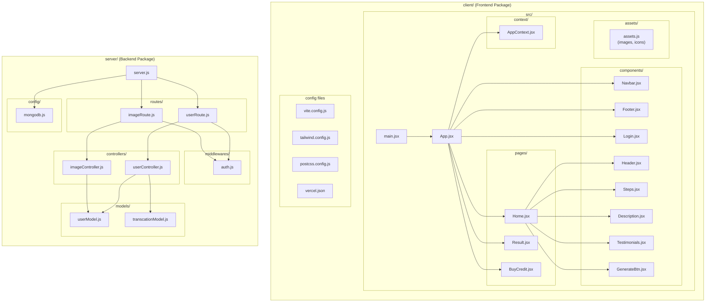

---

## 6. Data Flow Architecture

### 6.1 Request-Response Data Flow

```
┌───────────┐    ┌──────────────┐    ┌────────────┐    ┌──────────────┐    ┌────────────┐
│  Browser  │───►│  React SPA   │───►│  Axios     │───►│  Express.js  │───►│  MongoDB   │
│           │    │  (UI Layer)  │    │  (HTTP)    │    │  (API Layer) │    │  (Data)    │
│           │◄───│              │◄───│            │◄───│              │◄───│            │
└───────────┘    └──────────────┘    └────────────┘    └──────────────┘    └────────────┘
                                                              │
                                                              ├───►  ClipDrop API
                                                              │      (AI Generation)
                                                              │
                                                              └───►  Razorpay
                                                                     (Payments)
```

### 6.2 Authentication Data Flow

```
1. Client sends credentials ──► Server validates ──► Server returns JWT
2. Client stores JWT in localStorage
3. Client sends JWT in request headers for protected routes
4. Auth middleware extracts & verifies JWT ──► Injects userId into req.body
5. Controller uses userId to identify the user in the database
```

### 6.3 Credit System Data Flow

```
Registration:     User gets 5 free credits (default in schema)
Image Generation: User spends 1 credit per image (creditBalance - 1)
Credit Purchase:  User selects plan ──► Razorpay order ──► Payment ──► Verify ──► Add credits
```

---

## 7. Security Architecture

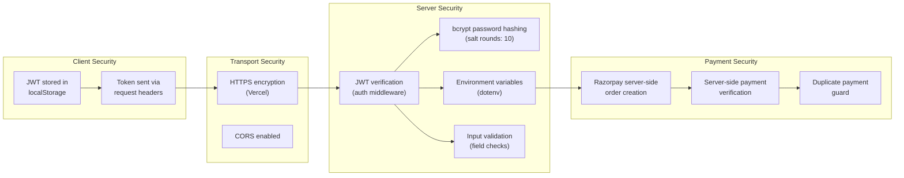

**Security Measures Summary:**

| Layer | Mechanism | Details |
|-------|-----------|---------|
| Password Storage | bcrypt | Salt rounds of 10; passwords never stored in plaintext |
| Authentication | JWT | Signed tokens with `JWT_SECRET`; stateless verification |
| Authorization | Auth Middleware | `auth.js` validates JWT before protected routes |
| Transport | HTTPS | Enforced by Vercel deployment |
| Cross-Origin | CORS | Enabled via `cors()` middleware |
| API Keys | Environment Variables | `CLIPDROP_API`, `RAZORPAY_KEY_ID`, `RAZORPAY_KEY_SECRET` via `dotenv` |
| Payment | Server-side Verification | Razorpay order verification + duplicate payment guard |
| Error Handling | Try-Catch | All controllers wrapped in try-catch; consistent JSON error responses |

---

## 8. Technology Stack Summary

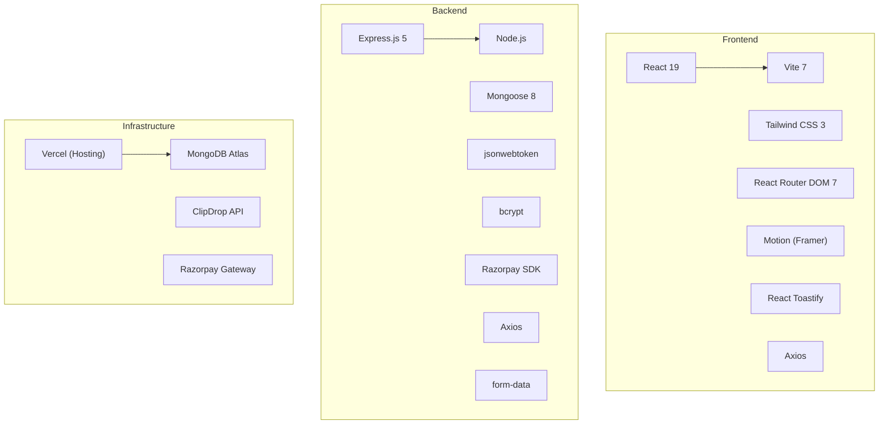

| Category | Technology | Purpose |
|----------|-----------|---------|
| **Frontend Framework** | React 19 | Component-based UI |
| **Build Tool** | Vite 7 | Fast dev server + production builds |
| **CSS** | Tailwind CSS 3 | Utility-first responsive styling |
| **Routing** | React Router DOM 7 | Client-side SPA routing |
| **Animations** | Motion (Framer Motion) | Page transitions and UI animations |
| **Notifications** | React Toastify | Toast notification system |
| **HTTP Client** | Axios | API communication |
| **Backend Framework** | Express.js 5 | REST API server |
| **Database ORM** | Mongoose 8 | MongoDB object modeling |
| **Authentication** | jsonwebtoken (JWT) | Stateless token-based auth |
| **Password Hashing** | bcrypt | Secure password storage |
| **Payment SDK** | Razorpay | Credit purchase processing |
| **AI API** | ClipDrop | Text-to-image generation |
| **Hosting** | Vercel | Frontend + Backend deployment |
| **Database** | MongoDB Atlas | Cloud NoSQL database |

---

## 9. Conclusion

The Imagify system follows a clean, well-structured **3-tier architecture** with clear separation between the presentation, application, and data layers:

1. **Presentation Tier (React SPA):** A responsive, animated single-page application that manages global state through React Context and communicates with the backend via Axios HTTP calls with JWT authentication.

2. **Application Tier (Express.js API):** A RESTful API organized in the MVC pattern with route handlers, controllers for business logic, middleware for authentication, and Mongoose models for data access. It integrates with two external services — ClipDrop for AI image generation and Razorpay for payment processing.

3. **Data Tier (MongoDB Atlas):** A cloud-hosted NoSQL database storing two primary collections — `users` (with credit balances) and `transactions` (with payment tracking).

**Key Architectural Strengths:**
- Independent deployability of frontend and backend
- Stateless JWT authentication enabling horizontal scalability
- Credit-based access control with transactional payment verification
- Consistent error handling and JSON response format across all endpoints
- Responsive UI with smooth animations for enhanced user experience

**Potential Areas for Enhancement:**
- Email verification during registration
- Admin dashboard for user/transaction management
- Rate limiting and request throttling
- Image generation history/gallery per user
- WebSocket integration for real-time generation progress
- Refresh token rotation for improved security

---

*This document was generated as part of the system design analysis of the Imagify project.*
